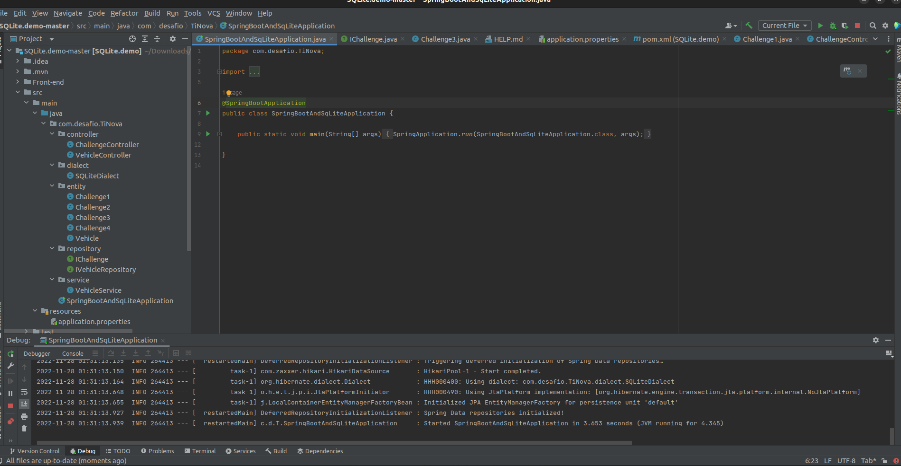
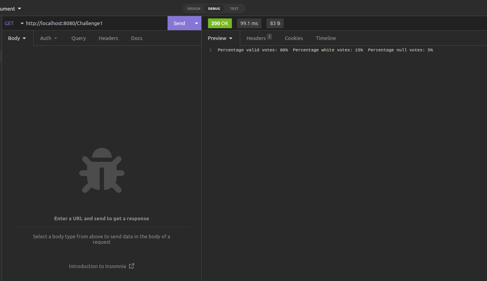
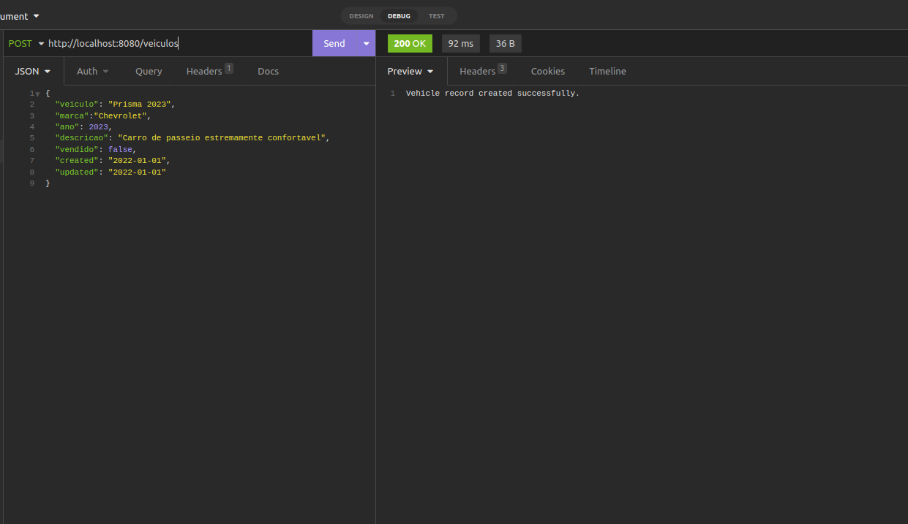
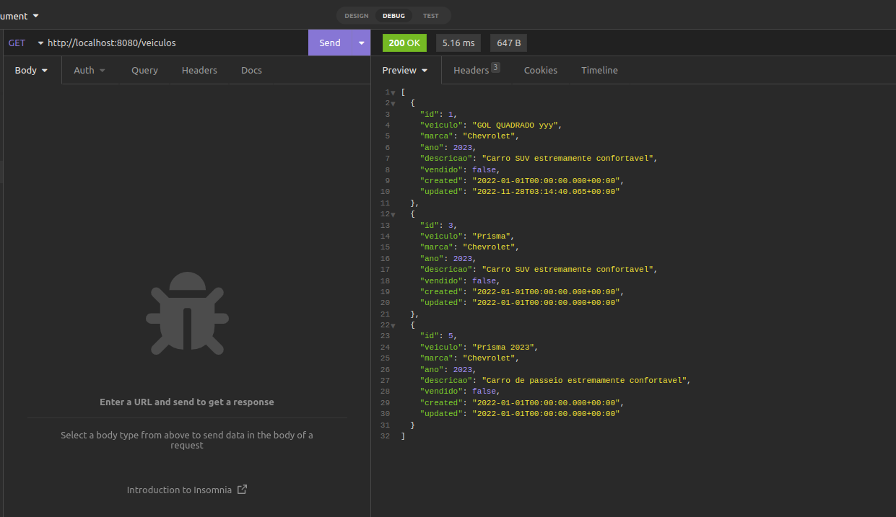
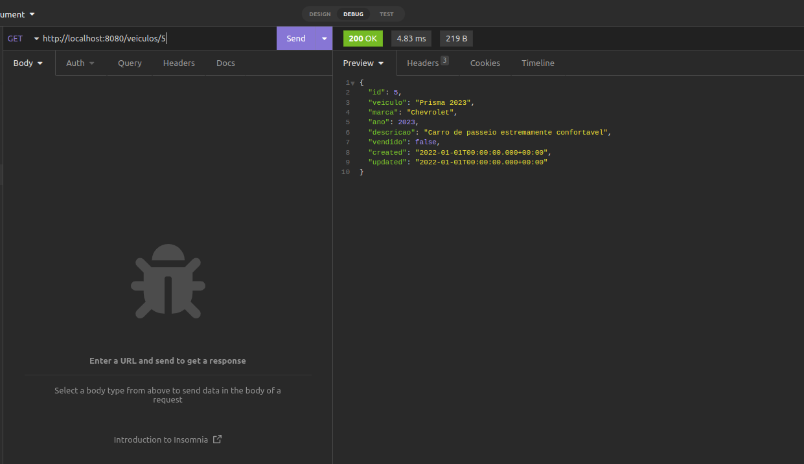

# Read Me Desafio TINova

Esse é um documento de apoio para deploy do projeto

* Não ha nenhum pré requisito tecnico para rodar o projeto, tentei por o banco acoplado na aplicação para facilitar 
  a analise do codigo.

* As questõs de 1 a 4 deixei elas acessando as rotas "Challenge1" até a "Challenge4" Ex: "http://localhost:8080/Challenge4/"
  Sendo que as duas ultimas esperam parametros.

* Já a ultima questão no documento é solicitado um end-point para campos que não foram especificados no DDL da tabela 
  exigida como base.

* Dentro da pasta "Front-End" está o que seria a minha single-page mas não consegui finalizar a tempo do prazo, 
  mas esta la como referência.

* E o arquivo "memory:myDb?cache=shared" é onde ficam salvos todos os dados, caso ele seja deletado, ao iniciar a aplicação sera criado um novo.

# Todo o código foi emplementado no LINUX.

1 - Segue abaixo print do projeto rodando localmente.

2 - Request na questão 1 como exemplo

3 - Request de Cadastro

4 - Request de consulta total

5 - Consulta registro unico

